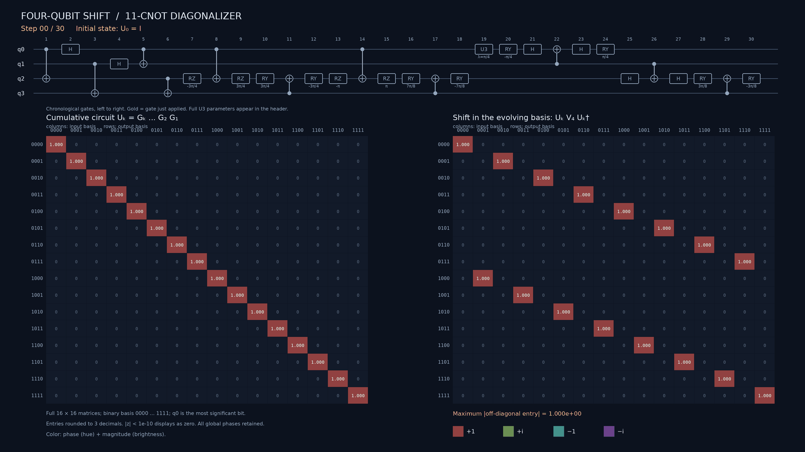

# Four-qubit cycle circuit optimization

[](docs/media/circuit-matrices-3.5x.mp4)

**[Watch or download the 4K video](docs/media/circuit-matrices-3.5x.mp4)** · 18.57 seconds · 3.5× speed

The animation follows the 30-gate, 11-CNOT circuit, showing the full cumulative
matrix and the conjugated shift after each gate. The active gate is highlighted;
complex entries are rounded to three decimals. The research records below include the certified eleven-CNOT construction
and the stopped search handoff.

This repository studies exact, ancilla-free diagonalizers of the four-qubit
right shift

`V4 |x0 x1 x2 x3> = |x3 x0 x1 x2>`.

Qubit zero is the most significant bit. Gates are listed in chronological
order. A valid diagonalizer satisfies `U V4 = D U`, with arbitrary eigenvalue
order and arbitrary orthonormal bases within degenerate eigenspaces.

## Current result

For arbitrary one-qubit gates and all-to-all directed CNOTs, the established
interval is **6 <= C_min <= 11**. The [accepted 11-CNOT circuit](experiments/runs/411/candidate.json)
has an [exact acceptance record](collaboration/EXACT11_ACCEPTANCE.json) with two
independent exact arithmetic certificates. The exact12 and exact13 constructions are preserved.
Optimality is open. The [exact 14-CNOT circuit](topology14_exact_matchgate_rational.json)
remains a preserved baseline. Native entangler counts use separate gate-set
definitions.

Read [current status](docs/STATUS.md) for the latest reviewed round and next
research question. The [artifact index](docs/INDEX.md) points to proofs,
certificates, scripts, and historical records.

## Verify the preserved exact-14 baseline

Run from this repository root:

```bash
python3 check_circuit.py topology14_exact_matchgate_rational.json
python3 exact_check.py topology14_exact_matchgate_rational.json
python3 delete14_integer_audit.py topology14_exact_matchgate_rational.json
```

The first check is numerical; the latter two are exact checks. The accepted
11-CNOT circuit uses exact rational-pi strings and can be checked with
`python3 exact_check.py experiments/runs/411/candidate.json`. The preserved
13-CNOT construction uses signed-radical metadata. All
certificate commands and limitations are recorded in
[the incumbent index](collaboration/incumbents.json).

## Work in this repository

- [Run protocol](docs/EXPERIMENTS.md): reserve a scientific ledger ID, create a
  run workspace, save a complete candidate and its limits, and finish the run.
- [Repository layout](docs/STRUCTURE.md): where to put new code, notes, run
  evidence, and manuscripts.
- [Candidate format](docs/CANDIDATES.md): chronological gate-list JSON and
  the scope of its numerical checker.
- [Collaboration board](collaboration/README.md): hypotheses, assignments,
  handoffs, and submissions.
- [Historical search record](docs/history/SEARCH_14_STATUS.md): chronological
  evidence, including failed and inconclusive attempts; the
  [12-CNOT](docs/history/search12/README.md) and
  [13-CNOT](docs/history/search13/README.md) search notes are grouped nearby.
- [Research notes](docs/research/README.md): lower-bound investigations and
  circuit derivations, grouped by topic and evidence status.
- [Legacy computation archive](archive/README.md): historical scripts and
  saved outputs, kept in their original flat namespace for reproduction.
- [Writing](writing/README.md): manuscripts and local source-material policy.

Historical root-level search files now live in `archive/legacy_root/`.
New runs belong in `experiments/runs/<ledger-id>/`; the ledger and its
content-addressed `candidates/` and `code_snapshots/` are authoritative.
